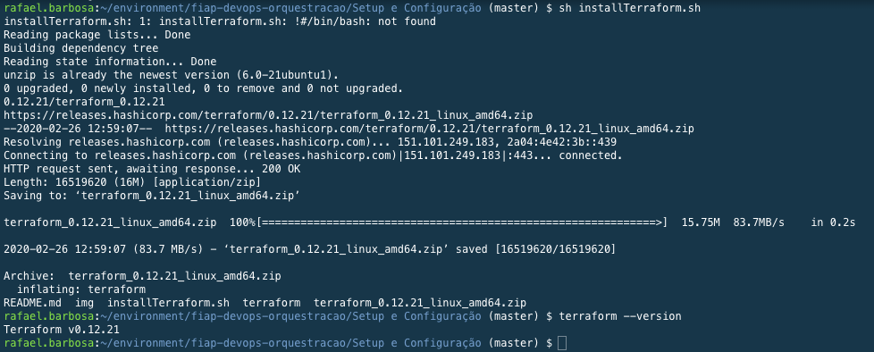
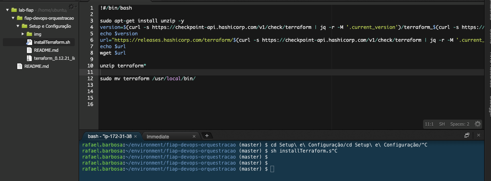
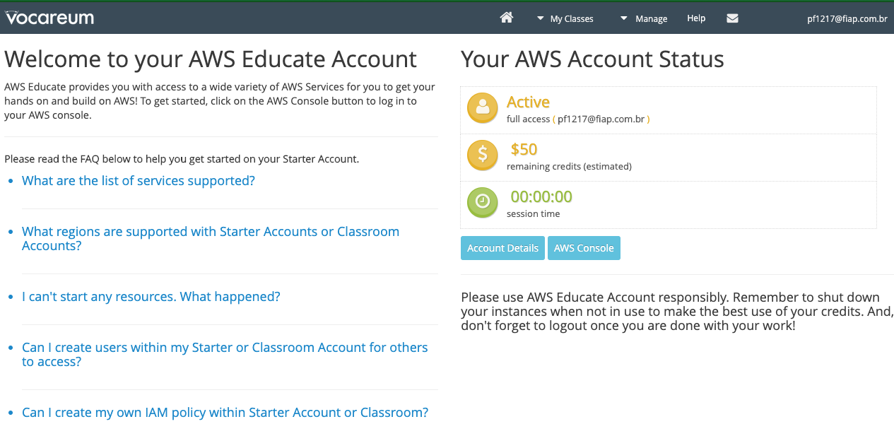
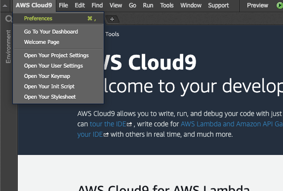
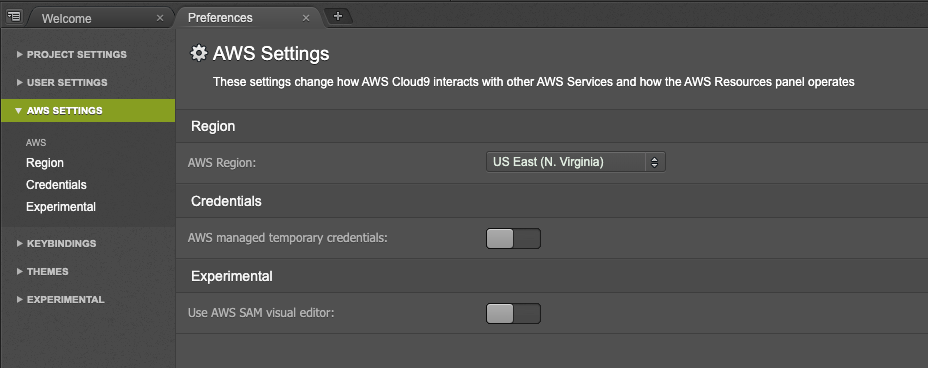

# Setup e Configuração de ambiente

 1. Abra o console da AWS e va para o serviço `Cloud 9`.
   
1. garanta que a região que esta utilizando é `us-east-1/ Norte da Virgínia`. Você consegue ver isso no canto superior direiro da tela.
    
 2. Clique em `create environment`.
 3. Coloque o nome `lab-fiap` e avance.
 
 5. Deixe as configurações como na imagem a seguir:

 6. Caso os parametros estejam como na imagem a seguir clique em `Create Environment`
   
 7. A criação do ambiente pode levar alguns minutos.

 8. Após a criação clique em `abrir IDE`, caso o IDE não tenha aberto automaticamente.
   
9. Para os próximos comandos utilize o console bash que fica no canto inferior do seu IDE.
   
10. Execute o comando `npm install -g serverless` para instalar o serverless framework.
    
11. Execute o comando `sudo apt  install jq -y` para instalar o software que irá nos ajudar a ler e manipular Jsons no terminal
12. Execute o comando `git clone https://github.com/vamperst/28ATI-fiap-devops-terraform.git` para clonar o repositório com os exercicios.
13. Execute o comando `cd 28ATI-fiap-devops-terraform/` para entrar na pasta criada pelo git
14. Execute o comando `cd Setup\ e\ Configuração/` para entrar na pasta com os scripts de Configuração.
15. Para instalar o terraform execute o comando `sh installTerraform.sh`
   
16. Caso queira ver o script que acabou de executar você pode navegar utilizando o IDE até o arquivo como na imagem:
   

    ## >>> As etapas a seguir devem ser executadas a cada 3 horas pois as chaves sofrem alteração <<<
17. No seu navegador vá a pagina do labs.vocareum.com por onde você entrou na sua conta. 
   
18. Clique em 'Account Details'
19. Clique em 'Show' e copie o conteudo que aparece em destaque
   
20.  Devolta a tela do IDE do Cloud9 clique em 'AWS Cloud9' no canto superior esquerdo e escolha 'Preferences'
   
21. Escolha 'AWS SETTINGS' no menu lateral e desabilite a função 'AWS managed temporary credentials'
    
22. De volta ao terminal do Cloud9 utilize o comando `rm -f ~/.aws/credentials` 
23. Utilize o comando `nano ~/.aws/credentials` para atribuir valores ao arquivo
24. Cole o conteudo da credential que copiou do vocareum
25. Salve com pressionando as teclas 'Control(CTRL) + X' e após 'Y'

    

    
